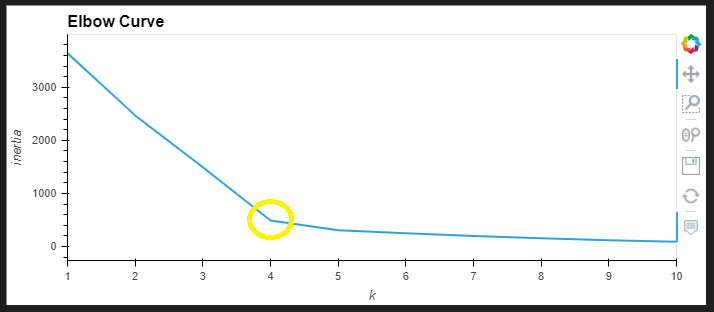
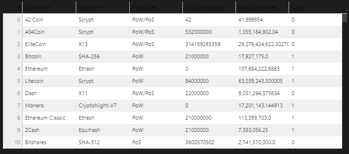
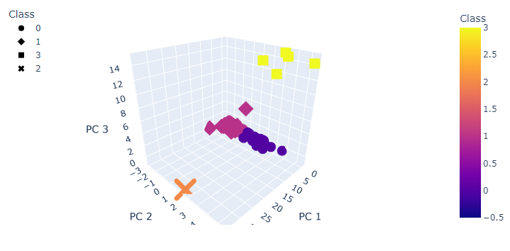
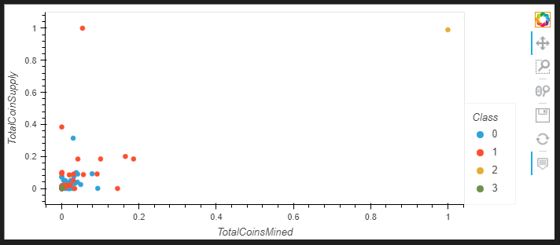

# Cryptocurrencies
## Overview
The purpose of this project is to utilize unspervised machine learning to perform an analysis of cryptocurrencies and visualize the results. To process of this analysis included: preprocessing of the data from the database, reducing the the demensions of the data using Principal Component Analysis (PCA), clustering them using K-Means, and visualizing the results with a 2-D and 3-D scatter plot and table. 

## Results
### K-Means Clustering - Elbow Curve
- Since we are using unsupervised learning and do not know that the ouput of the analysis will be, we needed to identify the number of clusters that would be best for this dataset. We used the elbow curve method to do this. The result found that 4 would be the best number of clusters, shown on the graph below. 

### Table of Cleaned and Merged Cryptocurrency Data

### 3D Scatter Plot of Principal Components

 
### 2D Scatter Plot of Total Coins Mined vs Total Coin Supply

## Summary 
We have classified 532 different coins into 4 groups based on the similarites of their features found by the machine learning model. 
